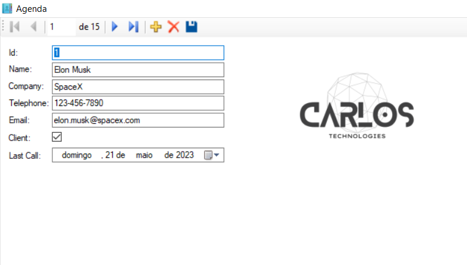

# AgendaForms
Programa em C# Forms que simula uma agenda com contato para empresarios

## Software criado utilizando Windows Forms .NET
### 🌱 Utilizando C# e Windows forms criei esse simples programa de CRUD para uma agenda
### O programa possui um banco de dados com o contato de pessoas famosas e/ou importantes para a tecnologia.

# prévia do Projeto

